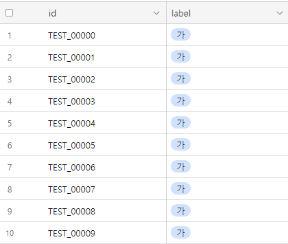

## [DACON COMPETITION : 2023 교원그룹 AI OCR 챌린지](https://dacon.io/competitions/official/236042/overview/description) 

[**Competition Abstract**]  
  This competition is a handwriting recognition AI model development competition. 
  
## Setup: 
  pip install -r requirements.txt 
  
### 1. Dataset (https://dacon.io/competitions/official/236042/data) 
A total of 2 text image folders and 3 csv files are provided in the competition.  
 1) train foler
    - 폰트 손글씨 학습 데이터
    - TRAIN_00000.png ~ TRAIN_76887.png
    
 2) test folder 
    - 폰트 손글씨 평가 데이터
    - TEST_00000.png ~ TEST_74120.png
    
 3) train.csv
    - id : 샘플 고유 id
    - img_path : 샘플 이미지 파일 경로
    - label : 샘플 이미지에 해당하는 Text
 
 4) test.csv
    - id : 샘플 고유 id
    - img_path : 샘플 이미지 파일 경로

 5) sample_submission.csv -> Submission file
    - id : 샘플 고유 id
    - label : 이미지로부터 예측한 Text

### 2. Data Example
 1) image
    

 2) csv
    - train.csv 
      

    - test.csv 
      

    - submission.csv 
      

### 3. Model Explanation
 1)
 2)
 3)
 4)
 
 ### 4. Certification
 
